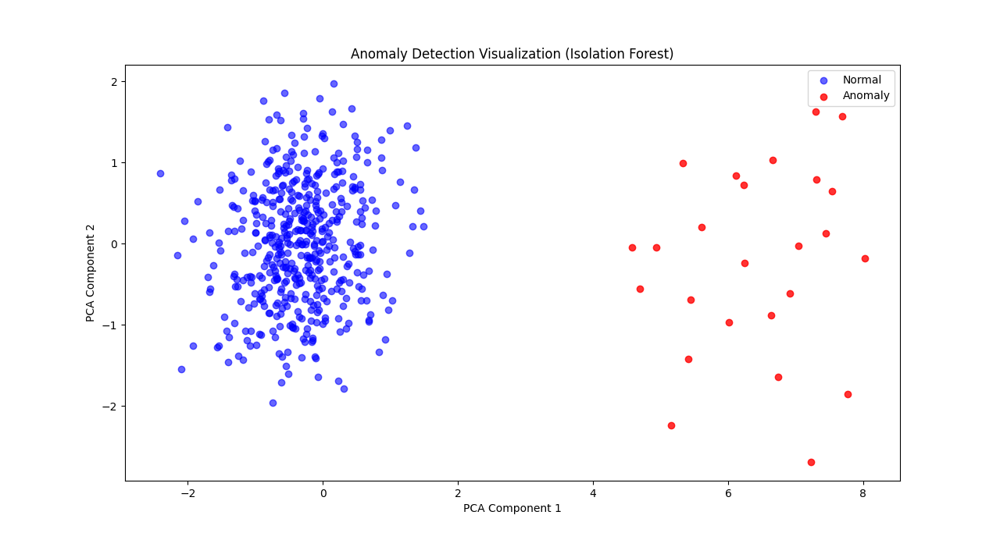

# anomaly-detection-ml
## 📊 Anomaly Detection Visualization

This plot shows the separation between **normal system behavior** and **detected anomalies**.
PCA is used only for visualization to project high-dimensional metrics into 2D.

ML project for anomaly detection using Isolation Forest
-How to design an end-to-end ML pipeline
-How Isolation Forest works for unsupervised anomaly detection
-importance of consistent preprocessing between training and inference 
-How to visualize high-dimensional data using PCA
